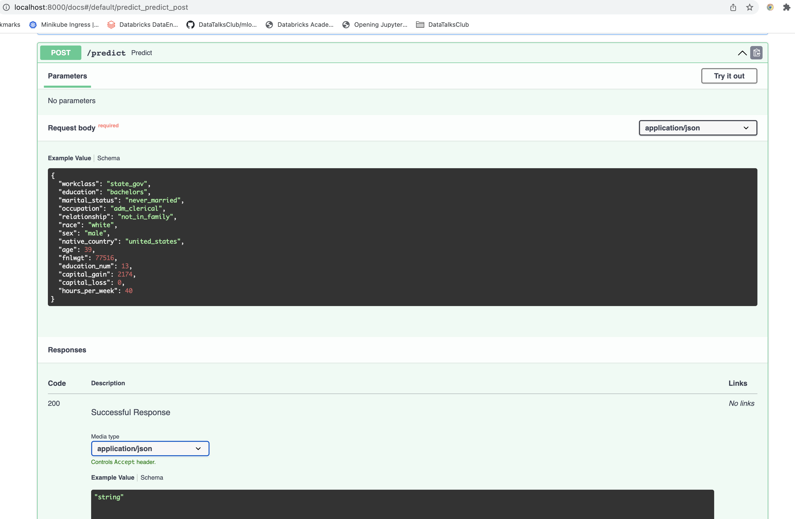

This repo contains the project files for Udacity MlDevops NanoDegree Course-3 `Deploying a Machine Learning Model on Heroku with FastAPI`

# Project Overview:
In this project, you will apply the skills you have acquired in this course to develop a classification model on publicly available Census Bureau data. You will create unit tests to monitor the model performance on various slices of the data. Then, you will deploy your model using the FastAPI package and create API tests. Both the slice-validation and the API tests will be incorporated into a CI/CD framework using GitHub Actions.

Two datasets will be provided in the starter code on the following page to experience updating the dataset and model in git.

The project contains:

##### CI with GitHub Actions
* Set up git with GitHub Actions for CI

##### Model building
* Create a machine learning model.
* Write unit tests.
* Write a function that computes model metrics on slices of the data.
* Write a model card.

##### API Creation
* Create a REST API using Flask API
* Create tests for an API.
  

##### API Deployment
* Deploy an app to Heroku.
* Query live API.

